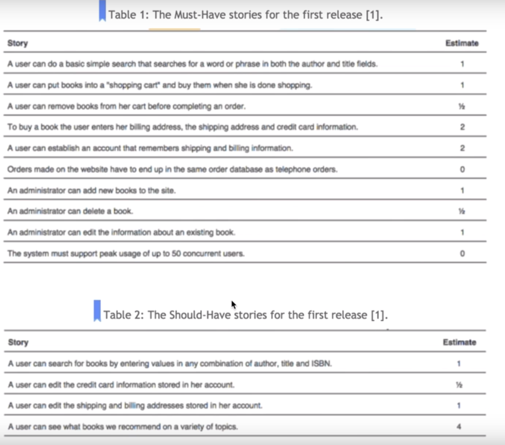
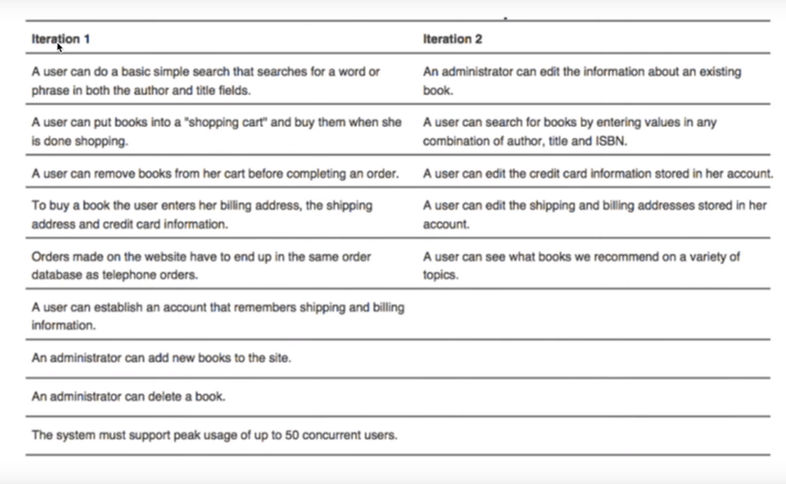

# Planning a Release
## Start From a Product Development Roadmap
- a prod development can be a list of the main area of focus for each of the next few releases (Kent Beck coined it as themes)
- for example, pick one of the following for the first release:
    - resume iltering and screening tools for companies
    - automate search agents for job seekers
    - improve query performance

## Initiating Release Planning
- before we begin, need to answer two questions:
    1. when do we want the release?
    2. what is the priority of each story?
- answering these two questions will allow us to
    - estimate how much work to be done per iteration
    - estimate how many iterations it will take to produce a release that meets the customer's expectation
    - 4 calendar weeks per release; two iterations each consisting of 2 calendar weeks

## What Would You Like in It?
- to plan a release, the **customer** must prioritize the stories
- MoSCoW rules (from *DSDM: Business Focused Development*)
    - **must have** features fundamental to the system
    - **Should have** features are imp but theres' a short term workaround for them
    - **Could have** features that can be left out of the release if time runs out
    - **Won't have this time**  features that are desired but acknowledged as needing to come in a later release

- in pictures, left column we put FULL stories, not shortened versions of what we wrote.
- 

- MoSCoW rules tell us the importance of the stories, rankings; doesnt tell us how to sort the stories

## Prioritizing the Stories
- many dimensions along which we can sort stories
- 
- technical factors:
    - the impact the story will have on other stories if deferred (e.g. we dont want to wait until the last iteration to learn that the application is to be three-tiered and multi-threaded).
    - 
- user based factor:
    - broad base of users or customers
    - small number of imp users or custoemrs
    - 
- cohesivness factor:
    - the likelihood of a story being performed in relation to other stories (e.g. a "zoom out" story may be low priority on its own, but will be high priority when paired with a higher priority story such as "zoom in")
    - 
- story mapping (refer to article in my shared drive for this class)

## Mixed Priorities
- if a cust has trouble prioritizing a story, consider splitting the story
    - allows the cust to prioritize the separate stories differently
- e.g. 'users can search for magazine articles by author, pub name, title, date or any combination of these'
    - if searching by author and title is essential, then split into three stories
        1.  searching by author and title
        2.  searching by publication name or date
        3.  combination

## Creating the Release Plan
- if the project has 80 story points (in our proj we map 1 sp to 1 ideal developer hour) and we estiamte 10 story points per iteration, then we can expect it to take eight iterations to compelte the entire project
- select 10 sp worth of the highest prioritiy stories and place them into the first iteration
- the next 10 go into 2nd iteration
- ...and so on until all stories have been allocated
- in our class, each iteration is 2 calendar weeks long
- example iterations for 4 weeks worth of work, makes up our first release:
- 
- listd from top to bottom, highest to lowest priority
- 